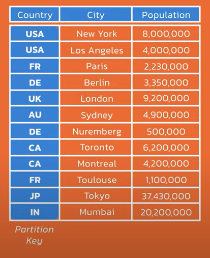
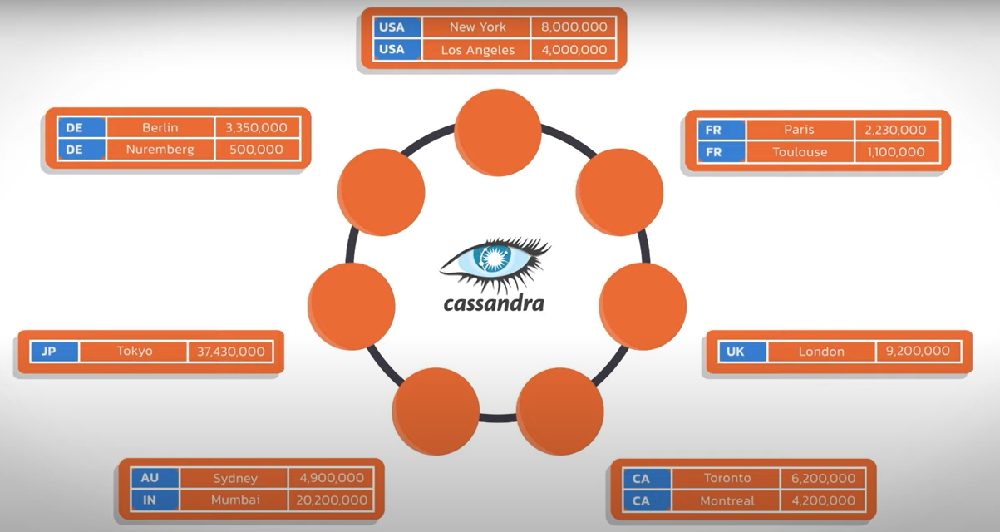
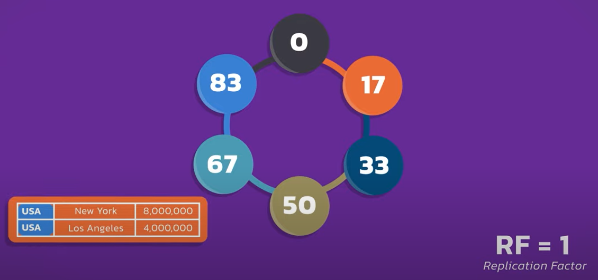
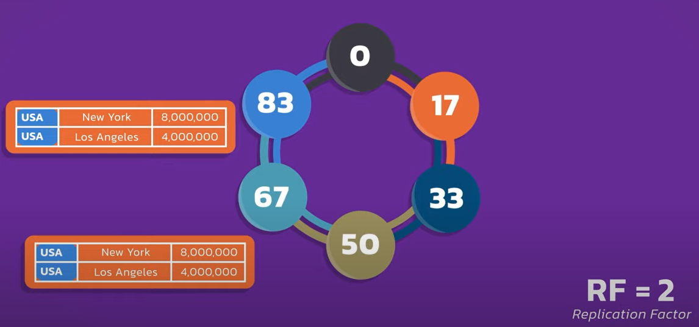
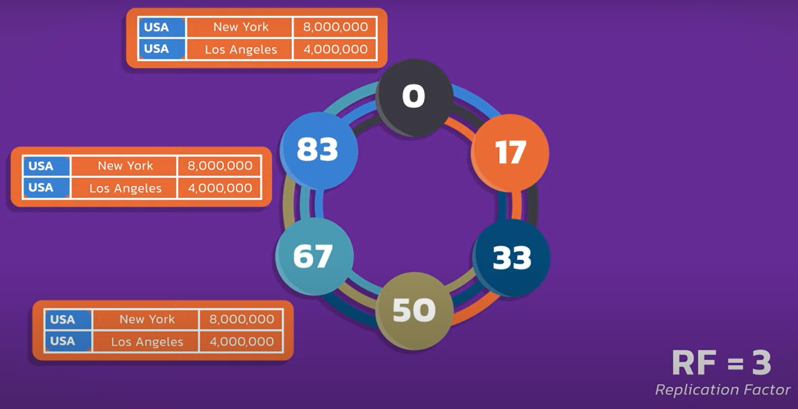
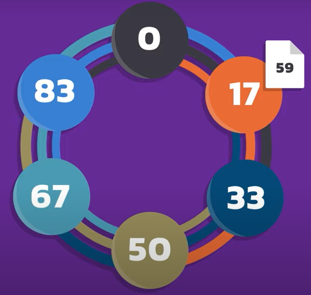
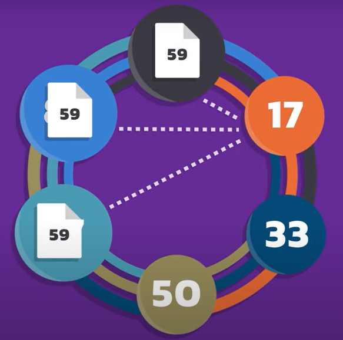
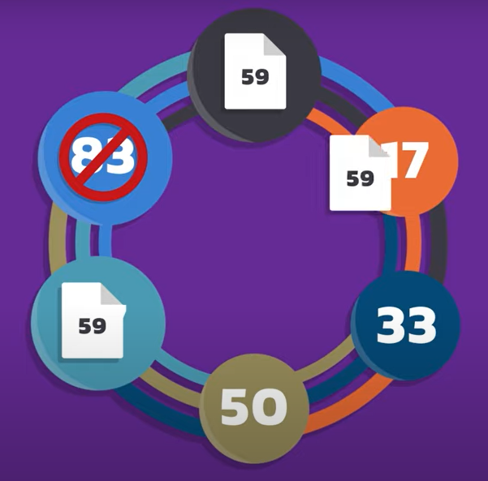
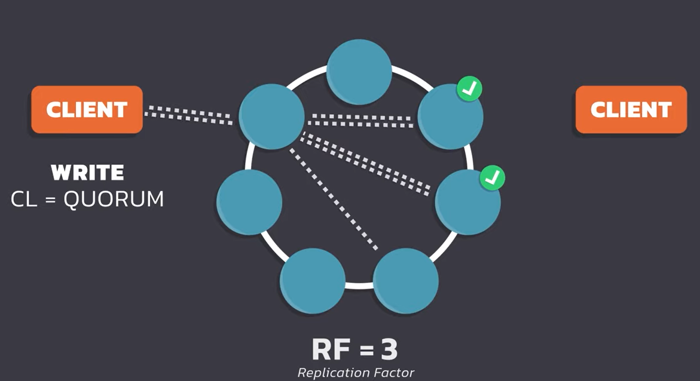
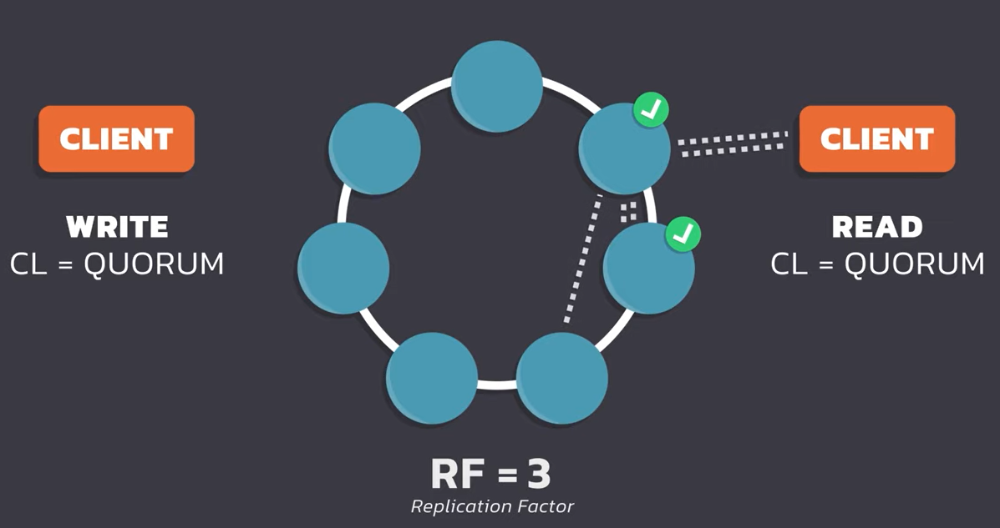

# Cassandra

## Esencial

- NoSQL Distributed Database
- Cada instancia de Cassandra se denomina nodo y este contiene toda una base de datos Cassandra.
- Cada nodo puede manejar unas 2 a 4 TB de datos y muchos miles de operaciones por segundo por core. La cantidad de operaciones depende los recursos asignados al nodo.
- Cassandra es una base de datos distribuida, aunque se pueda correr en un solo nodo. 
- Es un sistema sin líder y *peer-to-peer*, lo que significa que cada nodo puede hacer lo mismo que cualquiera.
- Los nodos se comunican a través de un protocolo llamado gossip que utilizan para trasladar información entre nodos.
- Los nodos están organizados en grupos llamados *data centers*, se puede representar como todos los nodos conectados por un aro.

## Características

- **Base de datos de nivel petabyte.** No solo Cassandra puede almacenar todos esos datos, sino que también mantiene rendimiento y escalado, algo por lo que Cassandra sobresale.
- **Base de datos siempre encendida.** Debido a que está construida para mantener un 100% tiempo de actividad, aún cuando haya casos de fallas de nodos. Hace esto gracias a su naturaleza distribuida, replicación automática y topología sin líder.
- **Distribución geográfica.** Es una manera de crear una base de datos global poniendo *data centers* donde sea necesario alrededor del mundo y Cassandra manejará la comunicación y replicación de los datos automáticamente.
- **Rendimiento.** A modo general, su escritura en la base de datos a una velocidad entre microsegundos a milisegundos, y su lectura es de milisegundos. Esto se mantiene si la base de datos tiene tres nodos o más ya que Cassandra escala linealmente e indefinidamente por lo que si se quiere mejor rendimiento basta aumentar la cantidad de nodos.
- **Independiente del proveedor.** Se puede instalar en cualquier dispositivo sin preocuparse por dependencias de un proveedor.

## Particionamiento

Una de las preguntas que se pueden venir a la mente es cómo sabe la base de datos dónde poner los datos o cómo conseguirlos después si se quieren leer. Esto se logra gracias a que los datos se dividen en particiones.

En este ejemplo podemos observar que la tabla tiene tres columnas y ***country*** es nuestra llave de partición, lo que significa que se dividen las filas basadas en el valor de nuestra llave de partición y serán almacenadas en un nodo y los datos se distribuirán automaticamente alrededor de los nodos en el *cluster*.

Los datos particionados se verían de esta forma:

El usuario es el que elige la llave de partición.

## Replicación

Para explicar la replicación, se tomará el siguiente ejemplo, el cual cada nodo tiene números asignados que son los *tokens* de partición y cada nodo es asignado un set de tokens que poseen. En este caso el nodo 0 tiene los tokens 84 a 0, el siguiente de 1 a 17 y asi sucesivamente.

Cuando añades una llave de partición a una tabla, ese valor se *hashea* automáticamente a un valor *token*, y gracias a ellos Cassandra sabe dónde almacenar y recuperar los datos. La llave de partición es como la dirección de los datos.

En este caso se muestra un factor de replicación de 1, que significa una copia de esa partición en un nodo.

Sin embargo, este número puede incrementar, al subir a dos el número de anillos aumentó en uno y ahora dos nodos tendrán esa partición.

Al aumentar a un factor de replicación de tres, se añade otro anillo y otra copia en otro nodo. El RF de tres es el estándar en Cassandra ya que da un balance entre disponibilidad, rendimiento y consistencia.

Para entender cómo los datos se almacenan y recuperan veremos el siguiente ejemplo. Dado un factor de replicación de tres queremos escribir algunos datos, por lo que para manejar la solicitud se escoge cualquier nodo, que será el nodo coordinador. Cualquier nodo puede ser un nodo coordinador. 

El número 59 es el *token* de partición que fue *hasheado* de la llave de partición para los datos que estamos escribiendo. Vemos que este es el valor de *token* de nuestra partición ejemplo. 

Como se tiene un factor de replicación de tres, hay tres nodos que poseen el rango de *token* que contiene a 59, en este caso serían los nodos 67, 83 y 0.
Luego el coordinador se va directo a los tres nodos y cada nodo tiene una copia.

Si un nodo está de baja durante el proceso, Cassandra guarda lo que se conoce como un *hint* y cuando el nodo vuelve a estar en línea, el *hint* se va hacia el nodo antes caído.

## Consistencia

Para explicar la consistencia que tiene Cassandra se hará con un ejemplo. Se tiene una partición con un factor de partición por defecto de tres, lo que hace que cualquier escritura será almacenada en tres nodos. Además de esto, se define un nivel de consistencia *quorum*, lo que significa que para cualquier solicitud la mayoría de nodos debe estar disponible. En este caso, Cassandra esperará por una verificación de dos nodos antes de hacer una escritura en la base de datos; si el nivel de consistencia no se puede obtener para una operación, esta fallará.

Para la operación de lectura, el cliente hace una solicitud, el coordinador lee desde dos nodos y el resultado va de vuelta al cliente. No importa cuáles dos nodos, mientras que estos tengan los datos que se quieran.

Al usar esta combinación de escritura y lectura quorum, se llama ***consistencia inmediata***.

